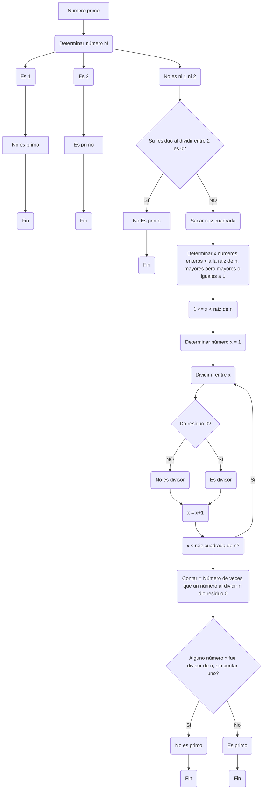
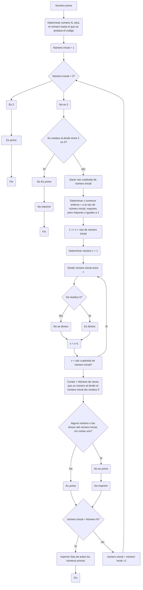
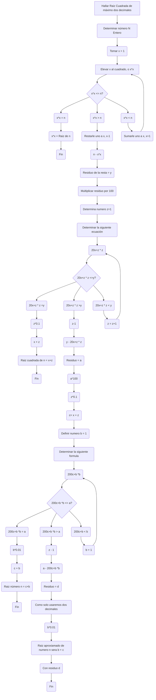

# Reto 3 Miguel Acevedo

## Primer punto

Plantear el algoritmo para obtener los números primos hasta n, usando pseudocódigo y diagramas de flujo.

#### Diagrama de flujo para determinar un número primo


#### Codigo para saber si un número es primo
```
Algoritmo definir_numeros_primos 
	
	Definir numero_n Como Entero
	Escribir 'Cual es numero_n'
	leer numero_n
	residuo_n_entre_2 = numero_n % 2
	x = 2
	raiz_numero_n <- RC(numero_n)
	si numero_n = 1 Entonces
		Escribir '1 no es número primo'
		//Descartamos 1 como primo, ya que de plano sabemos que no lo es
	SiNo
		si numero_n = 2 Entonces
			Escribir '2 es número primo'
			//Incluimos 2 como primo, esto porque es divisior de todos los pares, y el solo lo puede dividir uno
		SiNo
			si numero_n > 2 Entonces
				si residuo_n_entre_2 = 0.0 Entonces
					Escribir 'El número no es primo'
					//Descartamos todos los numeros pares, ya que todos son divisibles de dos
				SiNo
					Para i<-1 Hasta raiz_numero_n Con Paso 1 Hacer
						si numero_n mod i = 0 Entonces
							cont= cont +1
						FinSi
					Fin Para
					//Usamos la raiz utilizando la formula de la Criba de Erastotenes creando un ciclo de numeros de 1 hasta la raiz del número en el que mira si es o no divisor
					si  cont = 1 Entonces
						Escribir 'Si es un primo'
						//Cuenta todas las veces que el numero es divisible entre un número, si es 1, si es primo
					SiNo
						Escribir 'No es un primo'
						//Cuenta todas las veces que el numero es divisible entre un número, si no es 1, no es primo
					FinSi
				FinSi
			FinSi
		FinSi
	FinSi
	
	
finAlgoritmo
```
#### Diagrama de flujo para determinar Lista de número n



#### Codigo que determine lista de números que son primos hasta n
```
Algoritmo definir_numeros_primos 
	
	Definir numero_n Como Entero
	Definir numero_maximo Como Entero
	Definir x como entero
	Escribir 'Hasta que número quieres validar?'
	Leer numero_maximo
	x = 1
	Repetir
		numero_n = x 
		residuo_n_entre_2 = numero_n % 2
		raiz_numero_n <- RC(numero_n)
		cont=0
			si numero_n = 2 Entonces
				Escribir '2 Si es primo'
				//Incluimos 2 como primo, esto porque es divisior de todos los pares, y el solo lo puede dividir uno
			SiNo
				si numero_n > 2 Entonces
					si residuo_n_entre_2 <> 0.0 Entonces
						//Descartamos todos los numeros pares, ya que todos son divisibles de dos, pero colocamos el diferente de dos ya que solo buscamos una lista de los primos, por lo que imprimir un no primo no es esteticamente valido
						Para i<-1 Hasta raiz_numero_n Con Paso 1 Hacer
							si numero_n mod i = 0 Entonces
								cont= cont +1
							FinSi
						Fin Para
						//Usamos la raiz utilizando la formula de la Criba de Erastotenes creando un ciclo de numeros de 1 hasta la raiz del número en el que mira si es o no divisor
						si  cont = 1 Entonces
							Escribir numero_n ' Si es un primo'
							//Cuenta todas las veces que el numero es divisible entre un número, si es 1, si es primo
							//SiNo
							//Escribir numero_n ' No es un primo'
					//SiNo
							//Escribir numero_n ' No es primo'
							//Cuenta todas las veces que el numero es divisible entre un número, si no es 1, no es primo //esta entre parentesis porque no nos interesa que imprima el no es primo
						FinSi
					FinSi
				FinSi
			FinSi
		x = x + 1
	Hasta Que x>numero_maximo
	//Esto es repetir los números enteros postivios hasta un número que la persona desee crear la lista de los primos previos a el
finAlgoritmo
```
## Punto 2

Revise el procedimiento matemático para hallar raices cuadradas (son divisiones y restas), plantee el algoritmo en pseudocódigo y en diagrama de flujo.

#### Diaframa de flujo


#### Codigo
```
Algoritmo encontrar_raiz_de_un_numero
	Definir numero_ como Real
	Definir x como Real
	Definir paso_1 Como Real
	Definir residuo Como Real
	Definir n_Decimal_uno Como Real
	Definir raiz_un_decimal Como Real
	Definir residuo_2 Como Real
	Definir n_Decimal_dos Como Real
	Definir raiz_un_decimal_2 Como Real
	Definir raiz_dos_decimal Como Real
	Escribir 'Escoge un número'
	Leer numero_
	x= 0.0 
	n_Decimal_uno = 0.0
	paso_1 = x
	n_Decimal_dos = 0.0
	Repetir
		paso_1 = paso_1 + 1.0
	Hasta Que paso_1*paso_1 >= numero_
	//Iniciamos desde uno buscando un numero que al cuadrado sea igual o se pase al numero_
	si paso_1 * paso_1= numero_ Entonces
		Escribir paso_1 ' Es la raiz de ' numero_
		//Si dio igual significa que tenemos raiz exacta
	SiNo
		paso_1 = paso_1 -1
		//Esto dado que no nos sirve un número mayor, le restamos uno y tenemos el mayor numero elevado a si mismo que más se acerca a numero_ pero sigue siendo menor
		residuo = numero_ - (paso_1*paso_1)
		//buscamos el residuo del numero_ menos x al cuadrado 
		residuo = 100*residuo
		//lo multiplicamos por 100 ya que al igual que la división esto se hace para agregar la coma y usar decimales, en division es por 10 en raices por 100
		Repetir
			n_Decimal_uno = n_Decimal_uno + 1
		Hasta Que (20*paso_1 + n_Decimal_uno) * n_Decimal_uno >= residuo
		//Buscando un número que sumado a 20 veces a paso_1 (paso_1 = x) que mas se acercaba a y multiplicado por el mismo nummero que sea mayor o igual al residuo
		si 20*paso_1*n_Decimal_uno + n_Decimal_uno = residuo Entonces
			n_Decimal_uno = n_Decimal_uno * 0.1
			raiz_un_decimal = n_Decimal_uno + paso_1
			Escribir raiz_un_decimal ' es la raiz de ' numero_
			//Si encontramos algun número que funcione en la ecuacion y ser igual al residuo tomamos el numero (n_Decimal_uno) lo multiplicamos por 0.1 y lo sumamos a paso_1 (x) y ya tenemos numero con un decimal
		SiNo
			n_Decimal_uno = n_Decimal_uno - 1
			residuo_2 = residuo - ((20*paso_1+n_Decimal_uno) * (n_Decimal_uno))
			residuo_2 = 100*residuo_2
			n_Decimal_uno = n_Decimal_uno*0.1
			raiz_un_decimal_2 = paso_1 + n_Decimal_uno
			//Hacemos el mismo proceso anterior pero esta vez con los residuos de la resta usada para encontrar el primer decimal
			Repetir
				n_Decimal_dos = n_Decimal_dos +1
			Hasta Que (200*raiz_un_decimal_2 + n_Decimal_dos) * n_Decimal_dos >= residuo_2
			//Ahora buscamos lo mismo que en el paso anteior, con el n_Decimal_dos, y esta vez 200 veces el numero, esto dado que tenemos que eliminar la coma o punto
			si (200*raiz_un_decimal_2 + n_Decimal_dos) * n_Decimal_dos = residuo_2
				n_Decimal_dos = n_Decimal_dos*0.01
				raiz_dos_decimal = raiz_un_decimal_2 + n_Decimal_dos
				Escribir raiz_dos_decimal ' es la raiz de ' numero_
				//Encontramos un numero que funcione solo con dos decimales si es igual al residuo, se multiplica el n_Decimal_dos por 0.01, ya que sera el segundo decimal de nuestro número y lo sumaremos con raiz_un_decimal_2
			sino 
				n_Decimal_dos = n_Decimal_dos - 1
				n_Decimal_dos = n_Decimal_dos*0.01
				raiz_dos_decimal = raiz_un_decimal_2 + n_Decimal_dos
				Escribir raiz_dos_decimal ' es la raiz aproximada de ' numero_
				//Aproximamos el valor, ya que si continuamos caeremos posiblemente en un ciclo infinito de pasos
			FinSi
		FinSi
	FinSi 
FinAlgoritmo
```
